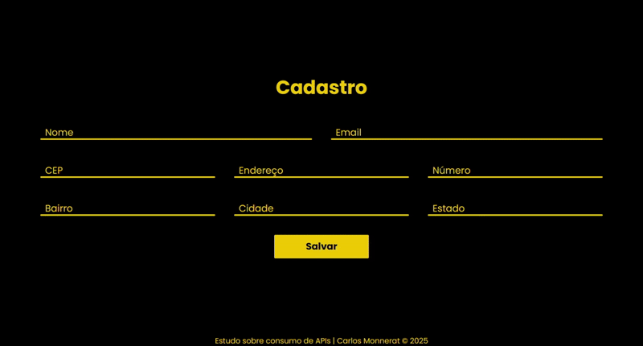

# 📮 Formulário com Preenchimento Automático de Endereço via CEP

Este projeto é um formulário web que preenche automaticamente os campos de endereço (rua, bairro, cidade e estado) assim que o usuário digita o **CEP**.

Desenvolvido com **HTML**, **CSS** e **JavaScript puro**, ele utiliza a API pública **ViaCEP** para buscar os dados em tempo real com base no CEP informado.

---

## 🎥 Demonstração

<p align="center">
  
</p>

---

## 🔗 Acesse o Projeto

Para visualizar o projeto em funcionamento, clique no link abaixo:

👉 [**Acessar o site**](https://youtube.com)


---

## ✨ Funcionalidades

- 🧾 Entrada de CEP pelo usuário
- 🔄 Consulta automática à API ViaCEP
- ✍️ Preenchimento dinâmico dos campos de endereço
- 📵 Tratamento de erros para CEPs inválidos ou inexistentes

---

## 📂 Tecnologias Utilizadas

- HTML5
- CSS3
- JavaScript (ES6+)
- API pública [ViaCEP](https://viacep.com.br/)

---

## 🚀 Como Usar

1. Acesse o link do projeto.
2. Digite um CEP válido no campo indicado.
3. Os campos de rua, bairro, cidade e estado serão preenchidos automaticamente.

---

## 📁 Estrutura do Projeto

```
📦 formulario-cep/
├── index.html
├── style.css
├── script.js
└── README.md
```

---

## 📌 Observações

- A API ViaCEP pode sofrer instabilidades ocasionais.
- Este projeto é ideal para fins didáticos e integração básica com APIs REST.

---

## 📄 Licença

Este projeto está licenciado sob a [MIT License](LICENSE).
